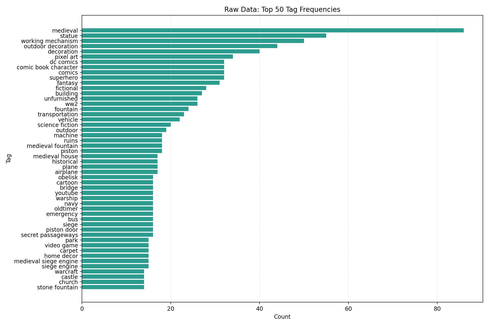
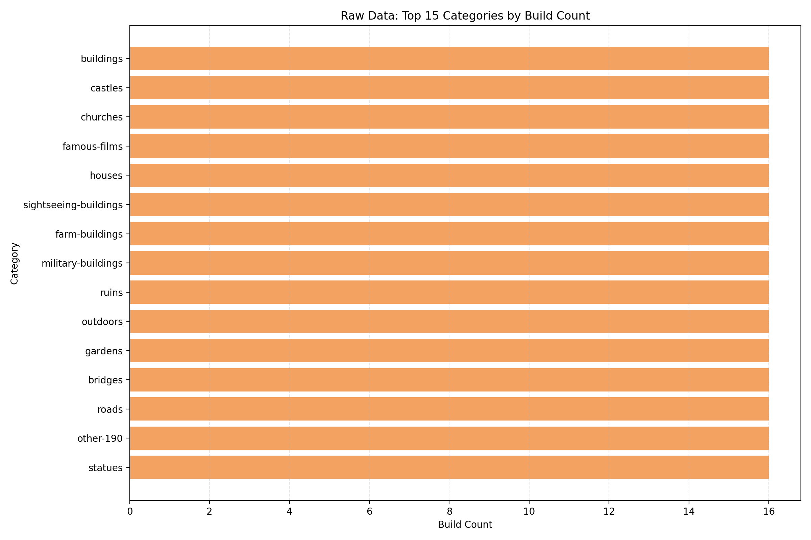
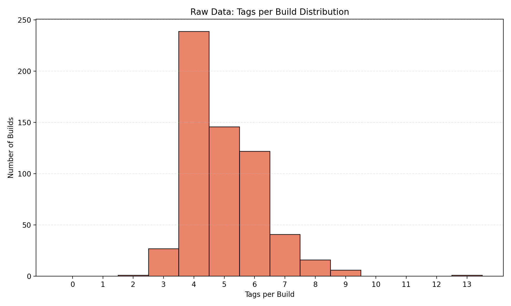
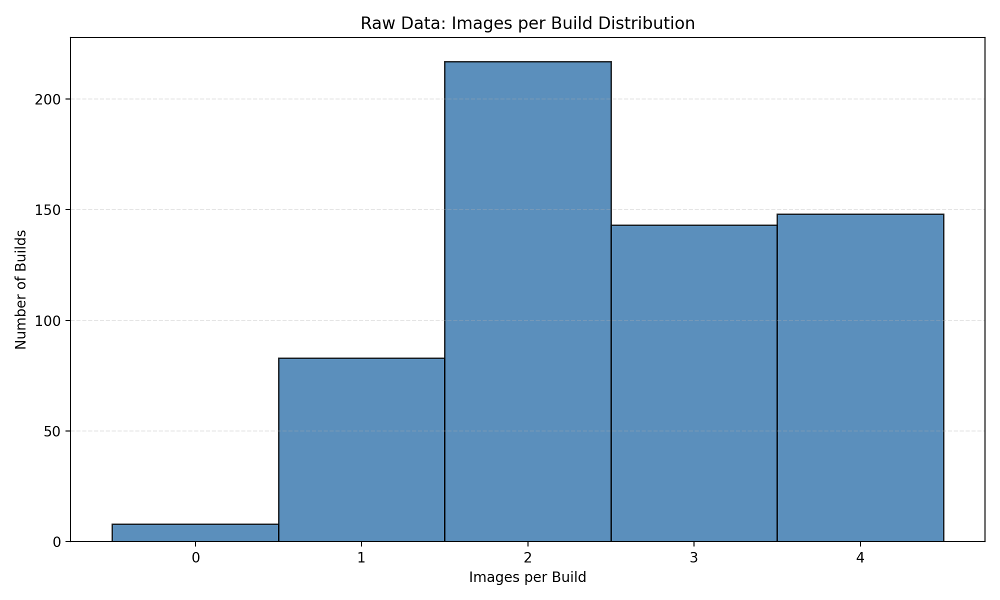
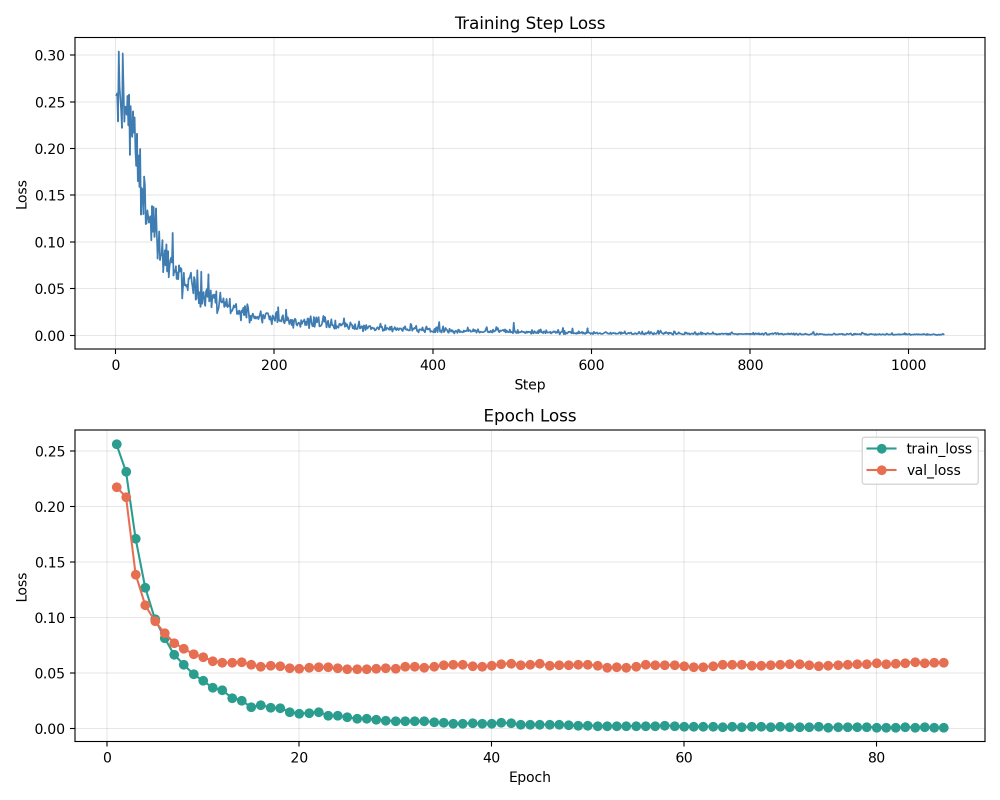
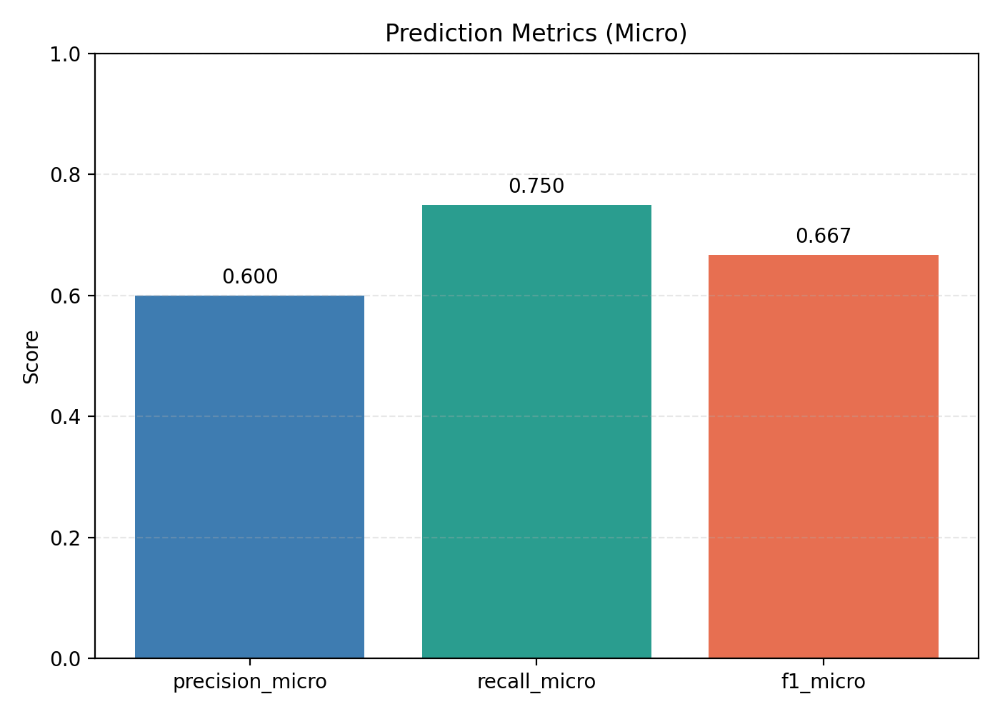
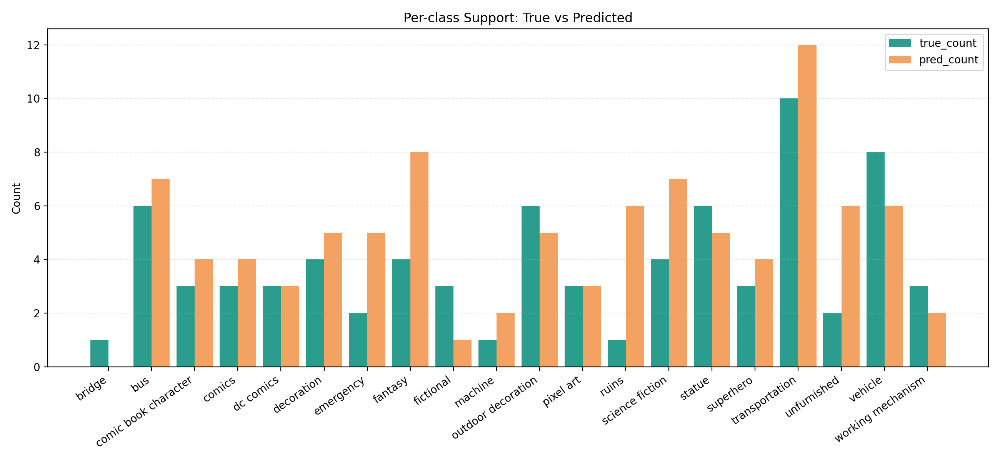
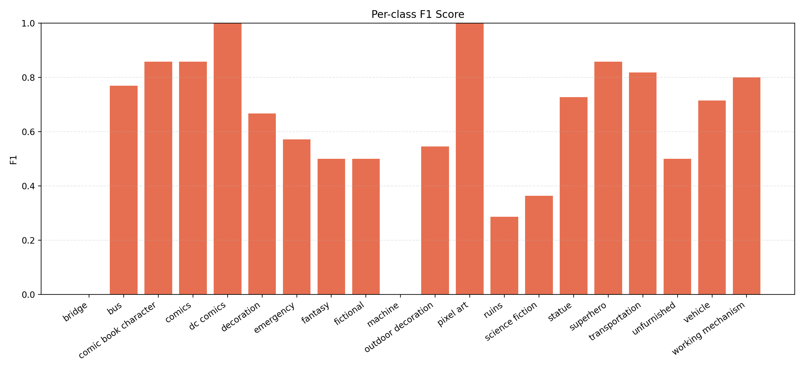
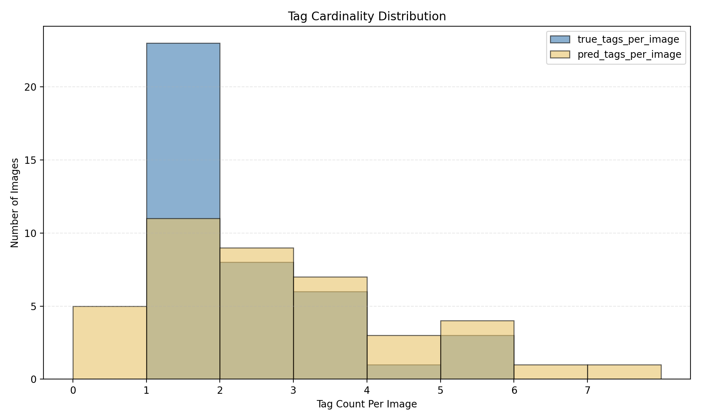

# MinecraftBuildAnalysis

This repository contains an end-to-end machine learning workflow for multi-label Minecraft build tag prediction. The workflow includes data scraping, data processing, dataset construction, model training, inference, and visualization.

## 1. Build and Run (Reproducibility First)

### 1.1 Environment Requirements
- Python 3.12
- pip
- Optional: GNU Make
- Optional: CUDA-capable GPU (training also supports CPU)

Main dependencies are listed in `requirements.txt`:
- Data scraping and parsing: `requests`, `beautifulsoup4`
- Image processing: `pillow`
- ML framework: `torch`, `torchvision`
- Visualization: `matplotlib`
- Testing: `pytest`

### 1.2 Install and Build with Makefile
From repository root:

```bash
make install
make build
make test
```

Windows fallback when `make` is unavailable:

```bash
python -m pip install --upgrade pip
python -m pip install -r requirements.txt
python -m compileall src scripts config
python -m pytest -q
```

### 1.3 Main Pipeline Commands

```bash
# scrape raw data
python scripts/run_scraper.py

# visualize raw metadata
python scripts/run_raw_visual.py

# process data and create train/val/test splits
python scripts/run_data_process.py

# visualize before/after processing
python scripts/run_data_process_visual.py

# train model
python scripts/run_train.py

# run inference and generate prediction visualizations
python scripts/run_predict.py
```

Equivalent Makefile targets are available:

```bash
make run-data-process
make run-data-process-visual
make run-raw-visual
make run-train
make run-predict
```

### 1.4 Reproduction Steps for Reported Results

Full reproduction flow (starting from scraping):
1. Install/build/test.
2. Scrape data and download images:
	- `python scripts/run_scraper.py`
3. Generate raw-data visualizations:
	- `python scripts/run_raw_visual.py`
4. Process data and create train/val/test splits:
	- `python scripts/run_data_process.py`
5. Generate before/after processing visualizations:
	- `python scripts/run_data_process_visual.py`
6. Train the model:
	- `python scripts/run_train.py --output-dir outputs`
7. Run inference and produce prediction visualizations:
	- `python scripts/run_predict.py --checkpoint outputs/best_multilabel_cnn.pt --output-file outputs/test_predictions.json --viz-output-dir outputs/prediction_visualization`

Output checklist:
- Model checkpoint: `outputs/best_multilabel_cnn.pt`
- Training metrics: `outputs/training_metrics.json`
- Training events: `outputs/training_events.jsonl`
- Prediction output: `outputs/test_predictions.json`
- Prediction visualizations: `outputs/prediction_visualization/*`

## 2. Testing

### 2.1 Local Testing
Test framework: `pytest`

```bash
python -m pytest -q tests
```

### 2.2 What Is Tested
The tests intentionally focus on high-impact logic:
- `tests/test_data_processor.py`
  - Valid-build filtering behavior
  - Deduplication preference for higher-quality duplicate records
  - Statistics calculation correctness
- `tests/test_tag_filter.py`
  - Blacklist + min-occurrence + top-k filtering behavior
  - Reproducible train/val/test split with fixed random seed

## 3. Data Visualizations

### 3.1 Raw Data Visualizations
These plots summarize the current raw dataset from multiple distribution views.









Why these plot types were selected:
- Horizontal bar chart is used for top-tag ranking because it supports long class names and direct frequency comparison.
- Histogram is used for per-build tag counts because the variable is discrete and the distribution shape is important.

### 3.2 Training and Prediction Visualizations
The following figures show training dynamics and prediction performance.











## 4. Data Processing and Modeling Method

### 4.1 Data Source and Collection
Data source: GrabCraft build pages.

Why this source was selected:
- Each build has multiple rendered images, which supports bag-level image modeling.
- Each build provides user-facing tags, enabling supervised multi-label training.

Collection approach:
- Crawl category pages, then build detail pages.
- Parse tags and image URLs.
- Download images locally and save structured metadata JSON.

### 4.2 Data Cleaning and Preprocessing
Data processing pipeline applies the following rules:
1. Remove builds without tags or without images.
2. Deduplicate builds using identity priority:
	- `build_url` -> `build_directory` -> first image path -> title
3. Keep the higher-quality duplicate record based on image count and tag count.
4. Apply tag filtering:
	- blacklist removal
	- minimum occurrence threshold
	- optional top-k label-space selection

Why these rules were selected:
- Missing tags/images provide incomplete supervision and weaken training signal.
- Deduplication reduces train/test leakage risk and over-counting.
- Frequency threshold and top-k reduce extreme label sparsity and improve optimization stability.

### 4.3 Dataset Construction
Build-level splitting strategy:
- Train/Validation/Test ratios: 70% / 15% / 15%
- Random seed for reproducibility

Dataset shape choices:
- Fixed `max_images_per_build` with mask padding

Why this representation was selected:
- A build is naturally a set of images rather than a single image.
- Fixed-size bags improve batching efficiency and training stability.

### 4.4 Modeling Method
Model architecture:
- MIL (Multiple Instance Learning) classifier with pretrained ResNet18 backbone
- Class-specific attention pooling
- Multi-label output head

Training configuration:
- Loss: ASL (Asymmetric Loss)
- Optimizer: AdamW
- Configurable data augmentation (flip/jitter/rotation/random crop/random erasing)
- Mixed precision when CUDA is available
- Gradient clipping and optional gradient accumulation
- Early stopping
- Class-wise threshold search on validation probabilities

Why these choices were selected:
- MIL is appropriate for build-level labels with multiple images per build.
- Pretrained backbone improves data efficiency.
- ASL is suitable for imbalanced multi-label learning.
- Class-wise thresholds are more appropriate than one global threshold when class calibration differs.

## 5. Results

### 5.1 Evaluation Metrics
Primary metrics:
- Micro Precision / Recall / F1
- Macro Precision / Recall / F1
- Sample-level F1
- Exact match ratio

Why these metrics were selected:
- Micro metrics summarize overall multi-label classification performance.
- Macro metrics capture class-level balance.
- Sample-level F1 and exact match measure per-sample label-set quality.

### 5.2 Quantitative Results

Dataset summary:
- Raw dataset: 599 builds, 1538 images, 774 unique tags

Model results:

| Tag Count | Val micro F1 | Test micro F1 | Test sample F1 | Test exact match |
|---|---:|---:|---:|---:|
| 20-tag | 0.8246 | 0.6512 | 0.5714 | 0.3171 |
| 30-tag | 0.8246 | 0.6667 | 0.6062 | 0.3415 |
| 50-tag | 0.6918 | 0.5143 | 0.4553 | 0.1167 |

Additional cardinality comparison:

| Tag Count | Avg true tags/image | Avg predicted tags/image | Prediction exact match |
|---|---:|---:|---:|
| 20-tag | 1.8537 | 2.3415 | 0.3171 |
| 30-tag | 1.8537 | 2.3171 | 0.3415 |
| 50-tag | 2.3000 | 3.5333 | 0.1167 |

### 5.3 Interpretation

- Label imbalance and long-tail distribution:
	- Many tags have low support, so the model receives limited positive examples for those classes.
	- This typically reduces recall and F1 on low-frequency tags.

- Label noise and semantic overlap in scraped tags:
	- User-facing tags may contain inconsistencies, spelling issues, or overlapping semantics.
	- This weakens supervision quality and makes boundary learning less stable.

- Build-level bag heterogeneity:
	- A build contains multiple images with different viewpoints and informational value.
	- Some images contribute weakly to tag evidence, which can reduce attention effectiveness.

- Thresholding trade-off:
	- The average predicted tag count is higher than the average true tag count.
	- This indicates a precision-recall trade-off biased toward recall for some classes, leading to over-prediction.

- Limited dataset size after filtering:
	- Filtering improves label quality but reduces total training samples.
	- For multi-label tasks, smaller sample size can hurt generalization on minority labels.

## 6. Future Work
- Add controlled ablations for backbone, loss, threshold strategy, and top-k settings.
- Improve calibration and cardinality control to reduce over-prediction.
- Add interactive visualization dashboards for per-class error analysis.

## 7. Repository Structure

```text
config/                  filtering config
data/                    default processed/raw data
scripts/                 pipeline entry scripts
src/                     core implementation
tests/                   unit tests
outputs/                 default run artifacts
outputs_30tags/          run artifacts used in this report
report_assets/figures/   figures used in this README
```